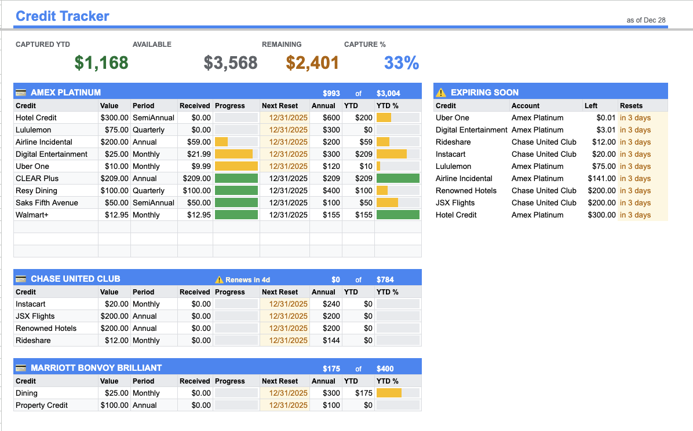
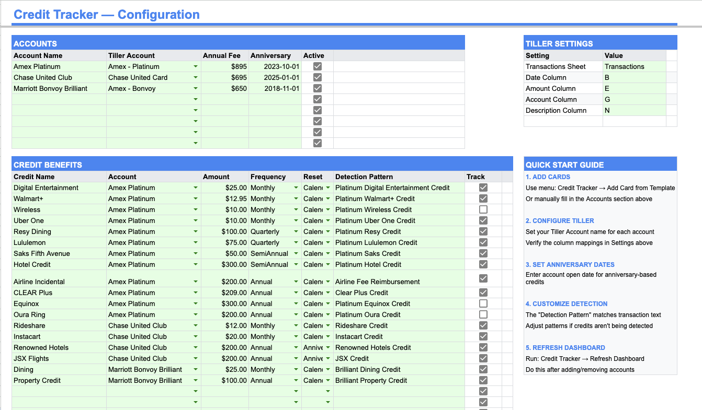

# Tiller Credit Tracker

Track recurring statement credits in your Tiller-powered Google Sheets. Automatically detects when credits post to your accounts and shows what's been captured, what's remaining, and what's expiring soon.

## What It Does

- **Automatic Detection**: Matches transaction descriptions to identify when credits post
- **Period Tracking**: Handles Monthly, Quarterly, Semi-Annual, and Annual reset schedules
- **Calendar & Anniversary**: Supports both calendar-year and account-anniversary based resets
- **Expiring Soon Alerts**: Highlights credits nearing their reset date with remaining value
- **YTD Summary**: See total captured vs. available across all accounts

## Screenshots

### Credits Tracker Dashboard

### Configuration Sheet

## Use Cases

While designed for **credit card statement credits** (like those from Amex Platinum, Chase Sapphire Reserve, etc.), this tracker works with any recurring credit or reimbursement that appears in your Tiller transactions:

- Credit card subscription reimbursements (streaming, Walmart+, etc.)
- Shopping credits (Saks, lululemon, etc.)
- Dining credits (Resy, restaurant credits)
- Travel/airline fee reimbursements
- Any recurring credit with a detectable transaction pattern

## Installation

### Step 1: Add the Script

1. Open your Tiller spreadsheet
2. Go to **Extensions > Apps Script**
3. Delete any existing code in the editor
4. Copy the entire contents of [`src/CreditTracker.gs`](src/CreditTracker.gs) and paste it
5. Save the project (Ctrl+S / Cmd+S)
6. Close the Apps Script editor

### Step 2: Run Initial Setup

1. Refresh your spreadsheet (the page, not the data)
2. You should see a new **Credit Tracker** menu appear
3. Click **Credit Tracker > Full Setup / Reset**
4. Authorize the script when prompted
5. Two new sheets will be created: **Credits Config** and **Credits Tracker**

### Step 3: Add Your Cards

1. Click **Credit Tracker > Add Card from Template...**
2. Select from the included templates (Amex Platinum, Chase Sapphire Reserve, etc.)
3. Or click **Credit Tracker > Add Custom Account** for cards not in the templates

### Step 4: Configure Your Accounts

In the **Credits Config** sheet:

1. **Tiller Account**: Select or type the exact account name as it appears in your Transactions sheet
2. **Anniversary**: Enter the date you opened the account (for anniversary-based credits)
3. **Detection Pattern**: Adjust if credits aren't being detected (pattern must match transaction description)

### Step 5: Refresh the Dashboard

Click **Credit Tracker > Refresh Dashboard** to update the tracker with your configuration.

## Included Card Templates

| Card | Annual Fee | Credits |
|------|-----------|---------|
| Amex Platinum | $895 | 11 credits (~$2,884/yr) |
| Amex Business Platinum | $895 | 10 credits (~$5,689/yr)* |
| Chase Sapphire Reserve | $795 | 6 credits (~$1,200/yr) |
| Chase United Club | $695 | 4 credits (~$800/yr) |
| Delta Reserve | $650 | 3 credits (~$600/yr) |
| Marriott Bonvoy Brilliant | $650 | 1 credit (~$300/yr) |
| Citi Strata Elite | $595 | 2 credits (~$400/yr) |
| Hilton Aspire | $550 | 3 credits (~$809/yr) |
| Amex Gold | $325 | 3 credits (~$324/yr) |

*Business Platinum includes high-spend unlock credits ($1,200 Amex Travel + $2,400 One AP) that require $250k annual spend. Without unlocks: ~$2,089/yr.

Templates are updated periodically. You can also add custom accounts with any credits you want to track.

## Tiller Settings

The tracker reads your Tiller configuration automatically. If you've customized your Transactions sheet, update the **Tiller Settings** section in Credits Config:

| Setting | Default | Description |
|---------|---------|-------------|
| Transactions Sheet | Transactions | Name of your transactions sheet |
| Date Column | B | Column containing transaction dates |
| Amount Column | E | Column containing transaction amounts |
| Account Column | G | Column containing account names |
| Description Column | N | Column containing transaction descriptions |

## Troubleshooting

### Credits Not Being Detected

1. Check the **Detection Pattern** in Credits Config matches your transaction descriptions
2. View your transactions to see the exact text used when credits post
3. Patterns are case-sensitive and match anywhere in the description

### Wrong Period Calculations

1. Verify the **Frequency** is set correctly (Monthly, Quarterly, etc.)
2. For anniversary-based credits, ensure the **Anniversary** date is set in the Accounts section
3. If you make a purchase late in the period, it may not post until the next period, just change the transaction date for the credit to a date in the period you want it to appear on your transactions sheet.

### Account Not Found

1. The **Tiller Account** must exactly match how it appears in your Transactions sheet
2. Check for extra spaces or different capitalization

## Removing the Tracker

To remove:
1. Delete the **Credits Config** and **Credits Tracker** sheets
2. Go to **Extensions > Apps Script** and delete the project

## Contributing

Found a bug or have a suggestion? Open an issue on GitHub.

## License

MIT License - feel free to use, modify, and share.

---

Built for the [Tiller Community](https://community.tillerhq.com/)
